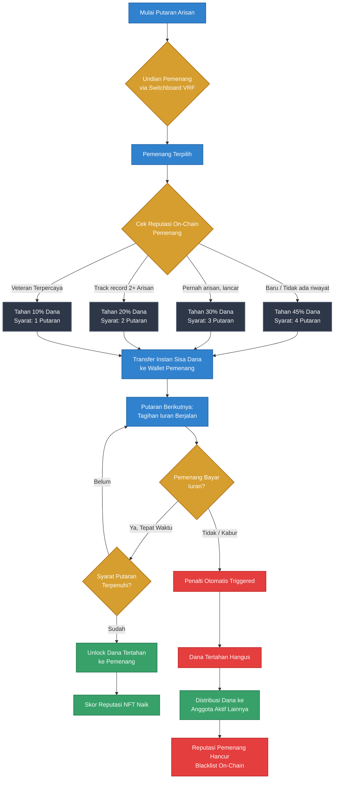

# Mekanisme Arisan: Delayed Payout & Reputasi Dinamis

Berikut adalah diagram alur logika dari smart contract yang menggabungkan sistem penahanan dana (delayed payout) dengan skor reputasi on-chain.

### Penjelasan Komponen Kritis:

1. **Switchboard VRF (Verifiable Random Function):** Memastikan undian 100% acak, transparan, dan tidak bisa diakali oleh pembuat program (krusial untuk kepercayaan).
2. **Dynamic Vault:** Porsi dana yang ditransfer dan ditahan dihitung secara dinamis oleh smart contract berdasarkan metadata dari NFT Reputasi pengguna.
3. **Slashing Mechanism (Penalti):** Jika peserta gagal bayar iuran lanjutan, kontrak otomatis mencabut hak mereka atas sisa dana di vault dan mendistribusikannya secara proporsional kepada anggota yang tidak kabur.
4. **Portable Reputation:** Skor loyalitas dicatat secara permanen di blockchain (bisa berbentuk Soulbound Token / Non-Transferable NFT), yang akan menjadi "credit score" terdesentralisasi bagi pengguna di ekosistem web3 Indonesia.
